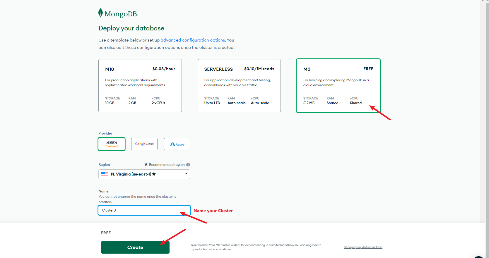
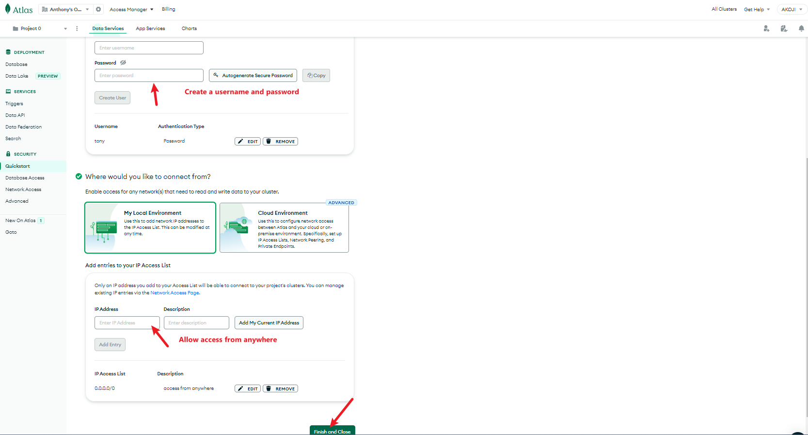
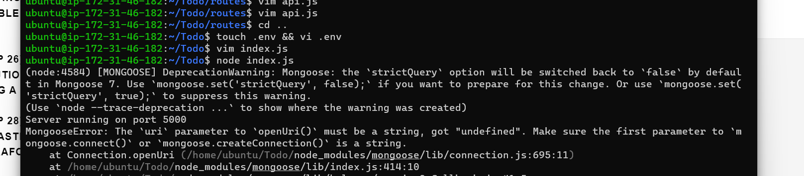

# **PROJECT 3: MERN IMPLEMENTATION**


This project is about configuring frontend and backend of MERN stack solution to deploy a "TO-DO" application that makes a list of tasks to do.

## BACKEND CONFIGURATION

### Install Node.js package

1. Create and EC2 instance based on Ubuntu 22.04 LTS in AWS

2. Update and upgrade **apt** package manager in Ubuntu 
    
    ```
    sudo apt update
    sudo apt upgrade
    ```


3. Download Node.js package from Ubuntu repositories 

    use: `curl -fsSL https://deb.nodesource.com/setup_18.x | sudo -E bash -`


4. Install Node.js: `sudo apt-get install -y nodejs`


5. Verify that both are installed:

    ```
    node -v
    npm -v
    ``````

### Create json file


1. Create a directory for your project and verify the directory has been created with `ls`

    `mkdir <name>` we can call the folder Todo


2. Inside the new folder run the command `npm init`. This creates a .json file for your application. Fill in the fields as you want and enter `yes` at the end to create the file. Confirm that the .json file was created  with `ls`


### Install ExpressJs


1. Run `npm install express` to install Express


2. Create an index.js file within the Todo folder with `touch index.js` and check that it has been created


3. Install dotenv with `npm install dotenv`


4. Run `sudo vim index.js` and paste the code below


    ```
    const express = require('express');
    require('dotenv').config();

    const app = express();

    const port = process.env.PORT || 5000;

    app.use((req, res, next) => {
    res.header("Access-Control-Allow-Origin", "\*");
    res.header("Access-Control-Allow-Headers", "Origin, X-Requested-With, Content-Type, Accept");
    next();
    });

    app.use((req, res, next) => {
    res.send('Welcome to Express');
    });

    app.listen(port, () => {
    console.log(`Server running on port ${port}`)
    });
    ```

5. Start the server with `node index.js`

    **Note** you need to be inside the same folder where index.js was saved for this to work

    If every thing goes well, you should see "Server running on port 5000" in your terminal

    *Comments: I had the error that there was a program running on port 5000, so I used the code `npx kill-port 5000` to kill that program

    


6. Open TCP port 5000 (which is specified in the index.js  code) in the inbound rules for your instance

    Test that you can access the server on port 5000. Use this `http://<PublicIP-or-PublicDNS>:5000` and a page will come up with the message "Welcome to Express"


### Routes


1. Create the Routes directory : `mkdir Routes`


2. Inside the Routes directory create a file named api.js

   ```
   cd Routes
   touch api.js
   ```


3. Run  `sudo vim api.js` and paste the code below


    ```
    const express = require ('express');
    const router = express.Router();

    router.get('/todos', (req, res, next) => {

    });

    router.post('/todos', (req, res, next) => {

    });

    router.delete('/todos/:id', (req, res, next) => {

    })

    module.exports = router;
    ```


### Models


1. Inside the Todo directory, install mongoose: `npm install mongoose`


2. Create a folder called "models", and inside it create a file named "todo.js": 

    `mkdir models && cd models && touch todo.js`


3. Paste the following code in the `todo.js` file 

    ```
    const mongoose = require('mongoose');
    const Schema = mongoose.Schema;

    //create schema for todo
    const TodoSchema = new Schema({
    action: {
    type: String,
    required: [true, 'The todo text field is required']
    }
    })

    //create model for todo
    const Todo = mongoose.model('todo', TodoSchema);

    module.exports = Todo;
    ```


4. Now go back to the Routes directory and change the code in the `api.js` file

    - delete the previous code with `:%d`

    - paste the new code 

        ```
        const express = require ('express');
        const router = express.Router();
        const Todo = require('../models/todo');

        router.get('/todos', (req, res, next) => {

        //this will return all the data, exposing only the id and action field to the client
        Todo.find({}, 'action')
        .then(data => res.json(data))
        .catch(next)
        });

        router.post('/todos', (req, res, next) => {
        if(req.body.action){
        Todo.create(req.body)
        .then(data => res.json(data))
        .catch(next)
        }else {
        res.json({
        error: "The input field is empty"
        })
        }
        });

        router.delete('/todos/:id', (req, res, next) => {
        Todo.findOneAndDelete({"_id": req.params.id})
        .then(data => res.json(data))
        .catch(next)
        })

        module.exports = router;
        ```


###  MongoDB Database


1.  Create an account on the MongoDB website here [mongodb](https://www.mongodb.com/atlas-signup-from-mlab). Follow the sign up process, create a shared free cluster (M0), select AWS as the cloud provider, and choose a region near you.

    - Complete the cluster startup settings as in the images below
    
    

    

    - In the "Network access" tab, change the time of deleting entry from 6 hours to 1 week

    


2. The `process.env` file mentioned in the `index.js` code is not yet created so you need to do that now

    Inside the Todo directory create a file named ".env" `touch .env`. 
    
    Open the file and paste the following in it `DB = 'mongodb+srv://<username>:<password>@<network-address>/<dbname>?retryWrites=true&w=majority'`

    **Note** You need to change the variables specified by the inequality symbols `<>` according to your setup

    Alternatively, you can get the connection string this way:

    1. On the left-hand side of the page click on **Database**

    2. In your Cluster tab click on **Connect**

    3. Click on **MongoDB Drivers**

    4. Make sure you have selected for **Driver** : "Node.js", and you will find the connection string below under "Add your connection string into your application code"


3. Update the `index.js` file so that it can use the .env file; substitute the previous code in the index.js with this


    ```
    const express = require('express');
    const bodyParser = require('body-parser');
    const mongoose = require('mongoose');
    const routes = require('./routes/api');
    const path = require('path');
    require('dotenv').config();

    const app = express();

    const port = process.env.PORT || 5000;

    //connect to the database
    mongoose.connect(process.env.DB, { useNewUrlParser: true, useUnifiedTopology: true })
    .then(() => console.log(`Database connected successfully`))
    .catch(err => console.log(err));

    //since mongoose promise is depreciated, we override it with node's promise
    mongoose.Promise = global.Promise;

    app.use((req, res, next) => {
    res.header("Access-Control-Allow-Origin", "\*");
    res.header("Access-Control-Allow-Headers", "Origin, X-Requested-With, Content-Type, Accept");
    next();
    });

    app.use(bodyParser.json());

    app.use('/api', routes);

    app.use((err, req, res, next) => {
    console.log(err);
    next();
    });

    app.listen(port, () => {
    console.log(`Server running on port ${port}`)
    });
    ```


4. Run `node index.js` to start your server
    
    *Comments: after getting the error below

    

    I changed my index.js code where it says ` //connect to the database` and added quote signs to process.env.DB like so

    

    But if you get errors, you will se the message **Database connected successfully** in you terminal


### Testing Backend Code without Frontend using RESTful API


1. You will use Postman to test your API, install it here [install_postman](https://www.postman.com/downloads/)


2. Watch this  [video](https://www.youtube.com/watch?v=FjgYtQK_zLE) to learn now how to perform CRUD operations on Postman


3. Open Postman and create a POST request to your API `http://<PublicIP-or-PublicDNS>:5000/api/todos`. With this request, a new task is added to your Todo list so that the application can save it in the database.


    **Note** Make sure the header Content-Type is set as application/json as in the image below


    

    This should be your result

    

    *Comments: I tried to run a POST request several times but I kept getting the error below, then I realized that I had exited the “node index.js” command which meant the connection with express server was not established


4. Create a GET request to your API `http://<PublicIP-or-PublicDNS>:5000/api/todos`. This request pulls up all of the records that are currently in our to-do application (backend requests these records from the database and sends it us back as a response to GET request).

    This should be the result

    


5. Try a DELETE request, remember to add the ID of the request you want to delete


## FRONTEND CONFIGURATION


1. Inside the Todo folder run ` npx create-react-app client`

    This will create a new folder called `client`, where you will add all the react code.


### Running a react app


1. Install `concurrently`, which allows to run more than one command concurrently from a single terminal window.

    `npm install concurrently --save-dev`


2. Install `nodemom` - this software allows to run and monitor the server and updates the server whenever there is a new  change in the server code

    `npm install nodemon --save-dev`


3. Inside the Todo folder, open the `package.json` file and change it where it says

    ```
    "scripts": {
        "test" : "echo \"Error: no test specified\" && exit 1"
    },
    ```

    to this 

    ```
    "scripts": {
    "start": "node index.js",
    "start-watch": "nodemon index.js",
    "dev": "concurrently \"npm run start-watch\" \"cd client && npm start\""
    },
    ```


### Configure Proxy in package.json


1. open package.json inside the client directory

    `cd client && vi package.json`


2. Add the key value pair in the package.json file `"proxy": "http://localhost:5000"`

    This is to make it possible to call the server url for the application straight from the browser, such as `http://localhost:5000` instead of writing the entire path like `http://localhost:5000/api/todos`


3. change back into the Todo directory and run `npm run dev`

    Your app should open and start running on `localhost:3000`

    **Note** you need to update the inbound rules for your EC2 instance so that it can open TCP port 3000 


### Creating your React Components

    
1. create a folder named "components" inside the src folder

    ```
    cd client/src
    mkdir components
    ``````


2. Inside this newly created folder crete 3 files named as in the command 

    `cd src` and `touch Input.js ListTodo.js Todo.js`


3. Fill the `Input.js` file with the code below 

    ```
    import React, { Component } from 'react';
    import axios from 'axios';

    class Input extends Component {

    state = {
    action: ""
    }

    addTodo = () => {
    const task = {action: this.state.action}

        if(task.action && task.action.length > 0){
        axios.post('/api/todos', task)
            .then(res => {
            if(res.data){
                this.props.getTodos();
                this.setState({action: ""})
            }
            })
            .catch(err => console.log(err))
        }else {
        console.log('input field required')
        }

    }

    handleChange = (e) => {
    this.setState({
    action: e.target.value
    })
    }

    render() {
    let { action } = this.state;
    return (
    <div>
    <input type="text" onChange={this.handleChange} value={action} />
    <button onClick={this.addTodo}>add todo</button>
    </div>
    )
    }
    }

    export default Input
    ```

    **Note** this code specifies `Axios` which you need to have installed in your machine 


4. Make sure you are inside the `clients` folder and run `npm install axios`


5. Change into the `components` directory inside src: `cd src/components`


6. Inside the `ListTodo.js` file paste the following code:

    ```
    import React from 'react';

    const ListTodo = ({ todos, deleteTodo }) => {

    return (
    <ul>
    {
    todos &&
    todos.length > 0 ?
    (
    todos.map(todo => {
    return (
    <li key={todo._id} onClick={() => deleteTodo(todo._id)}>{todo.action}</li>
    )
    })
    )
    :
    (
    <li>No todo(s) left</li>
    )
    }
    </ul>
    )
    }

    export default ListTodo
    ```


8. Then inside `Todo.js` write the following:

    ```
    import React, {Component} from 'react';
    import axios from 'axios';

    import Input from './Input';
    import ListTodo from './ListTodo';

    class Todo extends Component {

    state = {
    todos: []
    }

    componentDidMount(){
    this.getTodos();
    }

    getTodos = () => {
    axios.get('/api/todos')
    .then(res => {
    if(res.data){
    this.setState({
    todos: res.data
    })
    }
    })
    .catch(err => console.log(err))
    }

    deleteTodo = (id) => {

        axios.delete(`/api/todos/${id}`)
        .then(res => {
            if(res.data){
            this.getTodos()
            }
        })
        .catch(err => console.log(err))

    }

    render() {
    let { todos } = this.state;

        return(
        <div>
            <h1>My Todo(s)</h1>
            <Input getTodos={this.getTodos}/>
            <ListTodo todos={todos} deleteTodo={this.deleteTodo}/>
        </div>
        )

    }
    }

    export default Todo;
    ```


9. Move back into the src folder with `cd ..` and run `vi App.js`. Copy and paste the following into the file:

    ```
    import React from 'react';

    import Todo from './components/Todo';
    import './App.css';

    const App = () => {
    return (
    <div className="App">
    <Todo />
    </div>
    );
    }

    export default App;
    ```


10. In src open `App.css` and paste this into it:

    ```
    .App {
    text-align: center;
    font-size: calc(10px + 2vmin);
    width: 60%;
    margin-left: auto;
    margin-right: auto;
    }

    input {
    height: 40px;
    width: 50%;
    border: none;
    border-bottom: 2px #101113 solid;
    background: none;
    font-size: 1.5rem;
    color: #787a80;
    }

    input:focus {
    outline: none;
    }

    button {
    width: 25%;
    height: 45px;
    border: none;
    margin-left: 10px;
    font-size: 25px;
    background: #101113;
    border-radius: 5px;
    color: #787a80;
    cursor: pointer;
    }

    button:focus {
    outline: none;
    }

    ul {
    list-style: none;
    text-align: left;
    padding: 15px;
    background: #171a1f;
    border-radius: 5px;
    }

    li {
    padding: 15px;
    font-size: 1.5rem;
    margin-bottom: 15px;
    background: #282c34;
    border-radius: 5px;
    overflow-wrap: break-word;
    cursor: pointer;
    }

    @media only screen and (min-width: 300px) {
    .App {
    width: 80%;
    }

    input {
    width: 100%
    }

    button {
    width: 100%;
    margin-top: 15px;
    margin-left: 0;
    }
    }

    @media only screen and (min-width: 640px) {
    .App {
    width: 60%;
    }

    input {
    width: 50%;
    }

    button {
    width: 30%;
    margin-left: 10px;
    margin-top: 0;
    }
    }
    ```


11. In the src directory open the `index.css` and paste this code into it:

    ```
    body {
    margin: 0;
    padding: 0;
    font-family: -apple-system, BlinkMacSystemFont, "Segoe UI", "Roboto", "Oxygen",
    "Ubuntu", "Cantarell", "Fira Sans", "Droid Sans", "Helvetica Neue",
    sans-serif;
    -webkit-font-smoothing: antialiased;
    -moz-osx-font-smoothing: grayscale;
    box-sizing: border-box;
    background-color: #282c34;
    color: #787a80;
    }

    code {
    font-family: source-code-pro, Menlo, Monaco, Consolas, "Courier New",
    monospace;
    }
    ```


12. Go to the Todo directory and run `npm run dev`

    If everything was done correctly and you have no syntax errors in your files, the features creating a task, deleting a task, and viewing all of your tasks should be available and completely functional in your to-do app.

    


    


